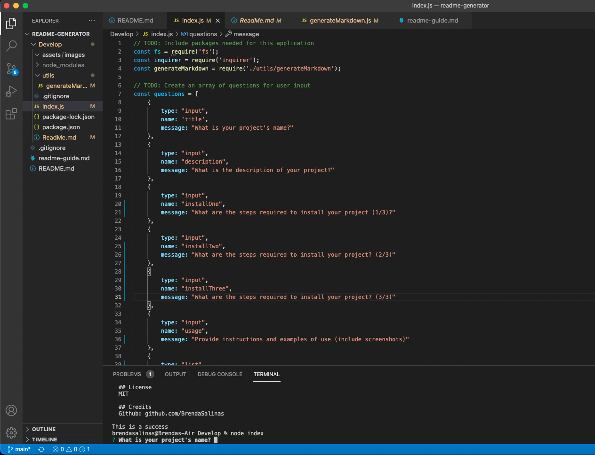
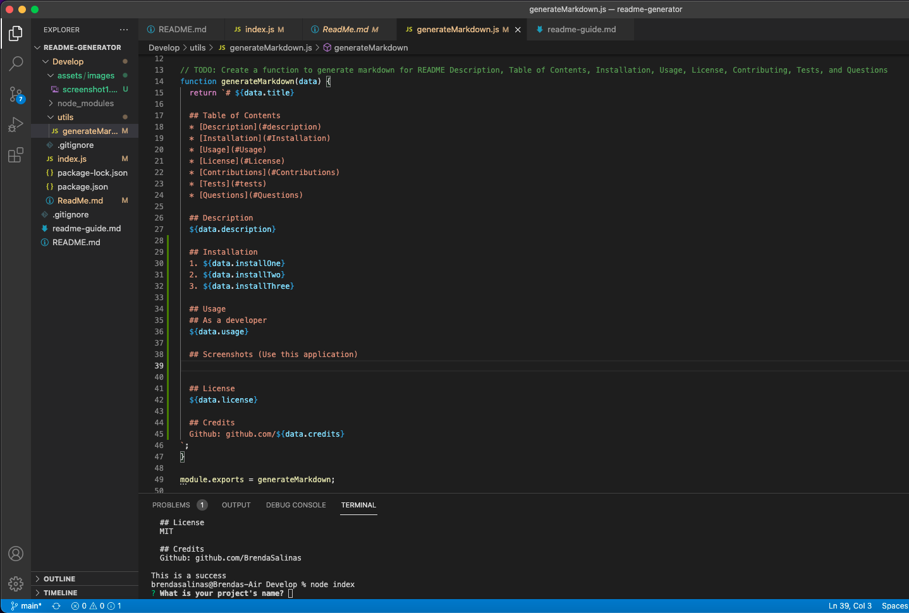

# README Generator

  ## Table of Contents 
  * [Description](#description)
  * [Installation](#Installation)
  * [Usage](#Usage)
  * [License](#License)
  * [Contributions](#Contributions)
  * [Tests](#tests)
  * [Questions](#Questions)
  
  ## Description
  Project allows developers to generate a professional readme file

  ## Installation
  1. 1
  2. 2
  3. 3

  ## Usage
  ## As a developer
  this is how it is supposed to be used

  ## Screenshots (Use this application)

  
  

  ## License
  MIT

  ## Credits
  Github: github.com/
